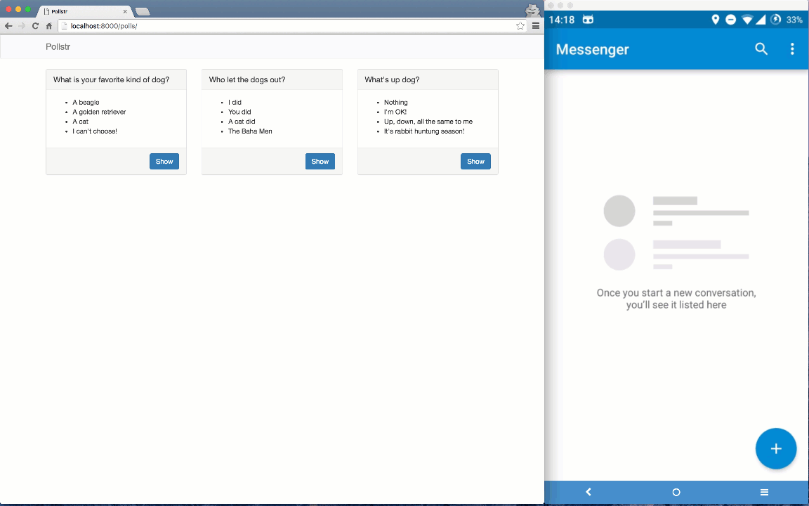

# Two Factor Authentication with Django and Nexmo Verify

A demo that implements 2-factor-authentication in Django using the built in auth framework and the [Nexmo Verify API](https://www.nexmo.com/products/verify/).

## Read the tutorial

For a more in-depth walk-through make sure you read the full tutorial on our blog; [Add Two factor Authentication to your Django app with Nexmo](https://www.nexmo.com/blog/2017/07/13/2-factor-authentication-sms-voice-django-dr/), or read more about the [Nexmo Verify API on our developer site](https://developer.nexmo.com/verify/overview)

## Basic Login - before branch

The [before](../../tree/before) branch is the starting point of the tutorial and is just a simple Django 1.9.8 app and some Bootstrap to provide a simple app with a login.

### Usage

* Clone this repository
* Run `git checkout before`
* Run `pip install -r requirements.txt`
* Run `python manage.py migrate`
* Run `python manage.py loaddata fixtures/all.json`
* Run `python manage.py runserver`
* Visit http://localhost:8000/
* Login with:
   * **username:** `test`
   * **password:** `test1234`

## Two Factor Authentication  - after branch

The [after](../../tree/after) branch is the end point of out tutorial, adding a `TwoFactorMixin` two our views and verifying a user's identity using their phone number.

The differences between these two branches can be seen [here](../../compare/before...after) and in our in-dept tutorial

### Usage

* Clone this repository
* Run `git checkout after`
* Run `pip install -r requirements.txt`
* Run `python manage.py migrate`
* Run `python manage.py loaddata fixtures/all.json`
* Copy `.env.example` to `.env` and add your [Nexmo API key and secret](https://dashboard.nexmo.com/settings)
* Run `python manage.py runserver`
* Visit http://localhost:8000/
* Login with:
   * **username:** `test`
   * **password:** `test1234`

## License

This sample is released under the [MIT License][license]

[license]: LICENSE.txt
